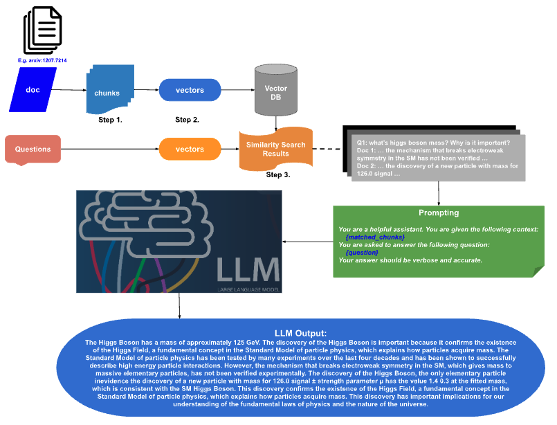

# Document Parsing and Prompting for LLM Question Answering with Local Device

## Introduction
This system is designed to efficiently handle document parsing and utilization
within the Question Answering phase of Large Language Models (LLMs). Here's a
breakdown of the process:

1. **Document Parsing**: The system parses the provided document, segmenting it
into manageable portions.

2. **Text Chunking**: The parsed document is further processed, breaking it down
into discrete text chunks. These chunks are then prepared for vectorization.
This step and the one above are achieved using the `unstructured` tool.

3. **Vectorization**: Each text chunk undergoes vectorization, transforming it
into an embedding vector. These vectors are stored within the FAISS (Facebook AI
Similarity Search) database, facilitating rapid access during subsequent phases.

4. **Prompting**: When prompted with a question or questions, the system
utilizes the embeddings of the query to conduct a search within the vector
database. The top-k closest matches are retrieved for further processing.

5. **LLM Question Answering**: The retrieved matches serve as prompts for the
LLM model, implemented through llama.cpp. The model utilizes these prompts to
generate accurate answers.

For a visual representation of the summarized flow of document chunking,
prompting, and LLM Question Answering, refer to the following chart.




### Use Cases

The system is primarily tailored for on-premises deployment, keeping in mind the
following use cases:

* **Privacy Concerns**: In scenarios where privacy is vital, users may prefer
not to upload sensitive documents to online servers. By operating locally, the
system ensures the protection of such documents.

* **Cost Efficiency**: Running the system locally eliminates any associated
fees, making it a cost-effective solution.

* **Educational Use**: The local deployment serves as an ideal environment for
learning purposes. Users can leverage the system as a playground to delve into
the intricacies of document chunking, text embedding algorithms, and various
Large Language Models (LLMs).

### Tools and Technologies Utilized

This study incorporates the following tools and technologies:

* **Docker**: Employed for containerization purposes, providing a consistent and
portable environment.

* **`unstructured`**: Utilized for text chunking operations. [Link to
`unstructured`](https://github.com/Unstructured-IO/unstructured)

* **FAISS**: Serves as the vector database, facilitating efficient storage and
retrieval of embedding vectors.

* **Langchain**: A framework which includes FAISS, ensuring
integration and enhanced functionality.

* **llama.cpp**: Responsible for serving the LLM, enabling effective question
answering. [Link to `llama.cpp`](https://github.com/ggerganov/llama.cpp)

* **TheBloke**: Quantized LLMs for efficient deployment. Accessible via
[TheBloke on Hugging Face](https://huggingface.co/TheBloke)

These tools and technologies collectively form the backbone of the study,
enabling robust document parsing and prompt-based LLM question answering.


## Set Up

```bash
python3 -m venv .venv 
source .venv/bin/activate 
```

### Setting Up a Private Network Using Docker

In this study, there are multiple Docker containers concurrently operational, where
inter-container communication is established via API requests. The following commands are executed 
to create a private network:

```bash
docker network create my-network
docker network ls
```

The above commands initiate the creation of a network named `my-network`,
enabling interaction among Docker containers within a secure and isolated
environment.

## Document Chunking with Unstructured

To execute document chunking using `unstructured`, refer to the steps below. The
`unstructured` tool can be found on its [GitHub
page](https://github.com/Unstructured-IO/unstructured).

### Step 1: Building a Docker Image for Unstructured

Initially, construct a Docker image with the base image of `unstructured`.
Additionally, include any personal tools required for other functionalities.
Execute the following commands for the first-time setup:

```bash
docker pull downloads.unstructured.io/unstructured-io/unstructured:latest
cd docker
source build_docker.sh
```

After completion, confirm the presence of `unstructured` in the repository list
by running `docker images`.

### Step 2: Building a Docker Container with Unstructured Image

* Generate a container using the provided script:

```bash
source scripts/build_container.sh
```

This script, as shown below, mounts `src/unstructured` to `src/` within the
Docker container's working directory:

```bash
workdir=/home/notebook-user
docker run -dt --name myunstructured  \
    --network my-network \
    -v ${PWD}/src/unstructured:${workdir}/src \
    -v ${PWD}/output:${workdir}/output \
    -v ${PWD}/input:${workdir}/input \
    unstructured:latest
```

Subsequently, verify the creation of a container named `myunstructured` by
executing `docker ps`.

### Step 3: Document Partitioning and Chunking

* Execute the Docker commands for document partitioning:

```bash
docker exec -it myunstructured bash -c "python3 src/document_partition.py -i [INPUT] -o [OUTPUT]"
```

Here, `[INPUT]` and `[OUTPUT]` can be either directories or files. If
directories are provided, all files within them will be processed individually,
with the basename of each file used as the output filename.

* Proceed with document chunking:

```bash
docker exec -it myunstructured bash -c "python3 src/chunking.py -i [INPUT] -o [OUTPUT]"
```

Replace `[INPUT]` and `[OUTPUT]` with appropriate filenames.

### Step 4: Search Capability via FAISS

The chunked text undergoes conversion to embedding vectors using the
`SentenceTransformer` model (`all-MiniLM-L6-v2`). These vectors are indexed and
stored in the FAISS vector database via `Langchain`.

Execute the Docker container for document search using the following command:

```bash
docker exec -it myunstructured bash -c "python3 src/vector_store.py -i [INPUT] -q \"HERE IS THE QUESTION\""
```

Substitute `[INPUT]` with the filename. The question follows using the `-q` tag.
The resulting list presents text chunks most relevant to the question.

## RAG with Pretrained LLM

### Step 1: Building a Docker Container with LLAMA.CPP

Referencing the [llama.cpp GitHub page](https://github.com/ggerganov/llama.cpp),
utilize the Docker image `ghcr.io/ggerganov/llama.cpp:server` to construct the
container for serving LLM models. Employ the provided script:

```bash
models_folder=${FOLDER_OF_LLM_MODEL}
model_file=${LLM_MODEL_FILE}

container_name=llamacpp_server
docker run -dt \
    --name ${container_name} \
    -p 8080:8080 -v ${models_folder}:/models \
    --network my-network \
    ghcr.io/ggerganov/llama.cpp:server -m /models/${model_file} \
    -c 512 --host 0.0.0.0 --port 8080
```

For `model_file`, models from [TheBloke](https://huggingface.co/TheBloke/LLaMa-7B-GGML) were tested, such as `llama-2-7b-chat.Q2_K.gguf`.

### Step 2: Question Answering with RAG

With `unstructured` for document chunking and vector searching, input a document and questions using the command below:

```bash
llamacpp_container_name=llamacpp_server
docker exec -it myunstructured bash -c \
    "python3 src/chatbot.py -u http://${llamacpp_container_name}:8080/completion "`
    `"-i INPUT_FILE_NAME -q \"HERE IS THE QUESTION\"" 
```

### Running Example
As an example, the following code is executed:

```bash
llamacpp_container_name=llamacpp_server
docker exec -it myunstructured bash -c \
    "python3 src/chatbot.py -u http://${llamacpp_container_name}:8080/completion "`
    `"-i input/1207.7214.pdf -q \"What is the mass of the Higgs Boson? "`
    `"Why is this discovery important?\"" 
```

Here, `1207.7214.pdf` is a paper downloaded from `arxiv`, titled `Observation of
a New Particle in the Search for the Standard Model Higgs Boson with the ATLAS
Detector at the LHC`. The questions provided are "What is the mass of the Higgs
Boson?" and "Why is this discovery important?"

The top three chunks, identified as the most relevant to the questions, are:

```
Higgs boson, more data are needed to assess its nature in detail.


The Standard Model (SM) of particle physics [1–4] has been tested by many
experiments over the last four decades and has been shown to successfully
describe high energy particle interactions. However, the mecha- nism that breaks
electroweak symmetry in the SM has not been verified experimentally. This
mechanism [5– 10], which gives mass to massive elementary particles, implies the
existence of a scalar particle, the SM Higgs boson. The search for the Higgs
boson, the only ele- mentary particle in


evidence the discovery of a new particle with mass for 126.0 signal ± strength
parameter µ has the value 1.4 0.3 at the fitted mass, which is consistent with
the SM Higgs boson hypothesis µ = 1. The decays to pairs of vector bosons whose
net electric charge is zero identify the new particle as a neutral boson. The
observation in the diphoton channel disfavours the spin-1 hypothe- sis [140,
141]. Although these results are compatible with the hypothesis that the new
particle is the Standard Model
```


The prompt for the generated answer is:

```
You are a helpful assistant. You are given the following context:

{matched_chunks}

You are asked to answer the following question:
{questions}

Your answer should be verbose and accurate.
```


The resulting answer:

```
The Higgs Boson has a mass of approximately 125 GeV. The discovery of the Higgs
Boson is important because it confirms the existence of the Higgs Field, a
fundamental concept in the Standard Model of particle physics, which explains
how particles acquire mass. The Standard Model of particle physics has been
tested by many experiments over the last four decades and has been shown to
successfully describe high energy particle interactions. However, the mechanism
that breaks electroweak symmetry in the SM, which gives mass to massive
elementary particles, has not been verified experimentally. The discovery of the
Higgs Boson, the only ele- mentary particle inevidence the discovery of a new
particle with mass for 126.0 signal ± strength parameter µ has the value 1.4 0.3
at the fitted mass, which is consistent with the SM Higgs Boson. This discovery
confirms the existence of the Higgs Field, a fundamental concept in the Standard
Model of particle physics, which explains how particles acquire mass. This
discovery has important implications for our understanding of the fundamental
laws of physics and the nature of the universe.
```
